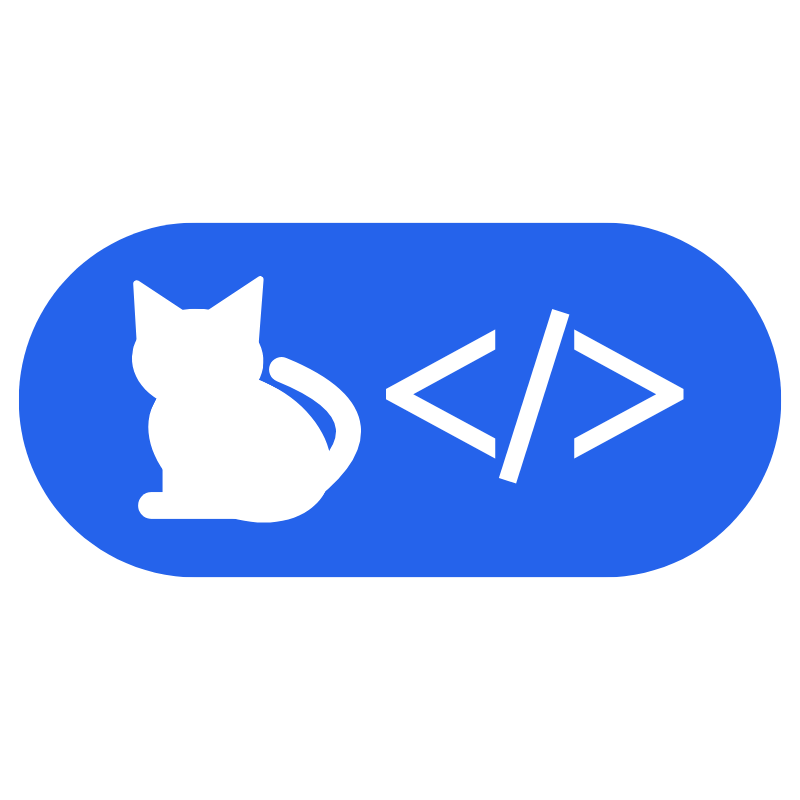

# DeployWise — Soluções Digitais sob Medida

Landing page comercial da **DeployWise**, uma softhouse brasileira focada em entregar desenvolvimento web de alta performance, sistemas escaláveis e design de experiência (UI/UX).



## 🚀 Tecnologias

Este projeto utiliza o que há de mais moderno no ecossistema web:

- **Framework:** [Next.js 15+](https://nextjs.org/) (App Router)
- **Linguagem:** [TypeScript](https://www.typescriptlang.org/)
- **Estilização:** [Tailwind CSS v4](https://tailwindcss.com/)
- **Componentes:** [shadcn/ui](https://ui.shadcn.com/)
- **Animações:** [Framer Motion](https://www.framer.com/motion/)
- **Ícones:** [Lucide React](https://lucide.dev/)

## ✨ Funcionalidades

- **Design Premium:** Estética moderna com glassmorphism, gradientes suaves e micro-animações.
- **Performance:** Otimização máxima com Next.js (Server Components, Image Optimization).
- **Responsividade:** Totalmente adaptado para dispositivos móveis, tablets e desktop.
- **Seções Estratégicas:**
  - Hero com animação de "typing" para autoridade técnica.
  - Portfólio dinâmico com grid interativo.
  - Processo de trabalho passo-a-passo.
  - Prova social e depoimentos de clientes.
  - Formulário de contato integrado.
- **SEO & Acessibilidade:** Meta tags configuradas e semântica HTML5 rigorosa.

## 📁 Estrutura do Projeto

O projeto segue uma arquitetura modular e escalável:

```text
src/
├── app/            # Rotas, layouts e páginas (App Router)
├── components/     # Componentes divididos por (ui, layout, sections, visuals)
├── data/           # Dados estáticos tipados para fácil manutenção
├── lib/            # Utilitários e constantes globais
├── types/          # Definições de interfaces TypeScript
└── hooks/          # Hooks customizados
```

## 🛠️ Como rodar localmente

1. Clone o repositório:
   ```bash
   git clone https://github.com/Daniel-Damasceno/deploywise-portfolio.git
   ```

2. Instale as dependências:
   ```bash
   npm install
   ```

3. Inicie o servidor de desenvolvimento:
   ```bash
   npm run dev
   ```

4. Acesse `http://localhost:3000` no seu navegador.

## 📄 Licença

Este projeto é de uso exclusivo da DeployWise.

---
Desenvolvido com ⚡ pela **DeployWise Team**.
